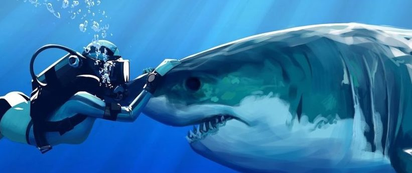

# Shark/human interactions

 

## Introduction:

Humans are not on the menu of sharks. Sharks bite humans out of curiosity or to defend themselves. With a better understanding of the significance of shark/human interactions we can **minimize the risk of being injured by a shark** and concentrate on the conservation of all shark species worldwide. In this way a education campaign can be done to teach people how to co-exist with sharks.

## Source:

· Dataset URL: https://www.kaggle.com/teajay/global-shark-attacks

## Description of the dataset:

ROWS: 

· Each row corresponds to a shark attack.

COLUMNS:

Column name   | Description
------------- | -------------
Case Number  | number of attack in register. 
Date  | date on which the shark attack occurs. 
Year | year of the shark attack. 
Type | type of shark attack.
Country | country on which the attack happens. 
Area| area within the country of the shark attack.  
Location| location within the area of the shark attack.
Activity| activity of the injuried while the accident. 
Name| name of the injuried. 
Sex| sex name of the injuried. 
Age| age name of the injuried. 
Injury| kind of injury. 
Fatal| YES/NO depending of the injury severity.
Time| hour and minute of the attack. 
Species| specie of shark that attacked. 
Source| source of the information provided. 

## Hipotheses:

The dataset under consideration needs some cleaning and processing depending on the questions for analysis. For this project, these are the following:

1) In which **month frame** are there more **shark attacks** per **country**?
    Month frames will be divided as shown below:
   - Dec-Feb: from December to February.
   - Mar-May: from March to May.
   - Dec-Feb: from December to February.
   - Sep-Nov: from September to November.
   
2) At what **time of the day** are there more **shark attacks** per **country**?
    Time frames will be divided as shown below:
   - 7-11: from 7 to 11 AM.
   - 12-17: from 12 to 17 PM.
   - 18-22: from 17 to 22 PM.
   - low afluency: from 23 to 24 PM and from 1 to 6 AM.

3) Which **activity** provokes more **fatal injuries** per **country**?
    - Fishing: fishing activities.
    - Low Water: low water activities (Swimming, Bathing, Floating, Body boarding, Body Surfing, Treading Water, Wading, Standing, Walking).
    - Sports Table: watersports with table (Surfing,Surf-skiing, Windsurfing, Boogie-boarding).
    - Sports Boat: watersports with boat (Rowing, Kayaking, Yachting, Canoeing).
    - Underwater: watersports underwater (Scuba-diving, Pearl-diving, Free-diving, Snorkeling).
    - Fell: accidents occured when falling from a boat, table, dock, among others. 

## Spoiler!

If you don't want to get bit by a shark avoid wandering in **New Smyrna Beach (Florida)** between 12 and 5 in the Summer. [Bryan](https://www.surfline.com/surf-news/hurricane-matthew-passes-sharks-show-up-at-the-inlet-shark-attacks-surfer-in-new-smyrna-beach_142356/) was hit on the knee while surfing in  this beach and, while there was a reasonable amount of blood, turns out he's fine!

